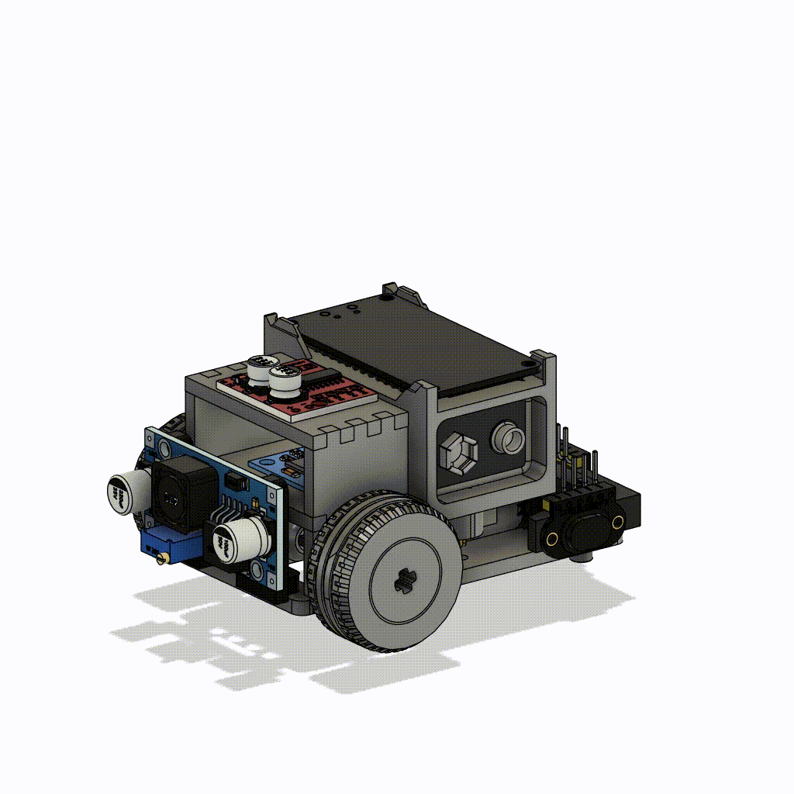
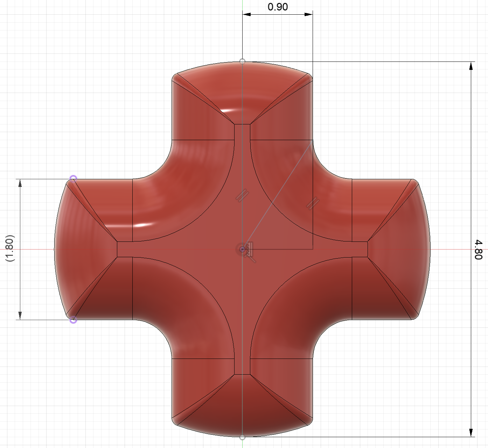
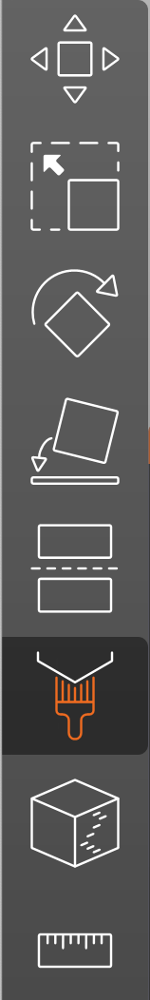
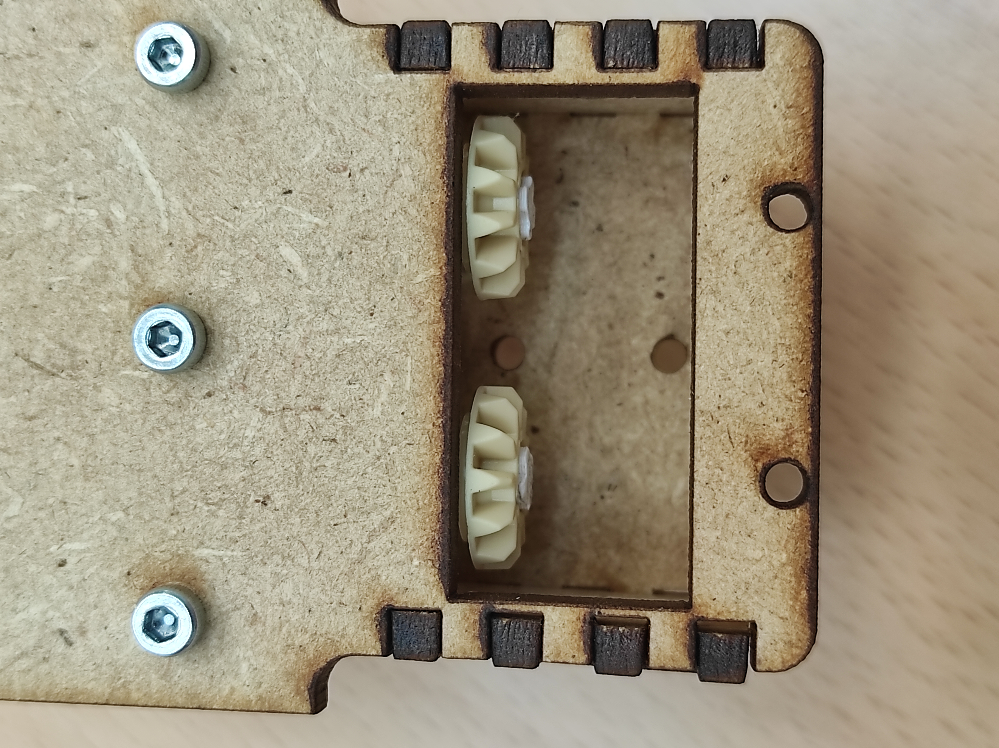
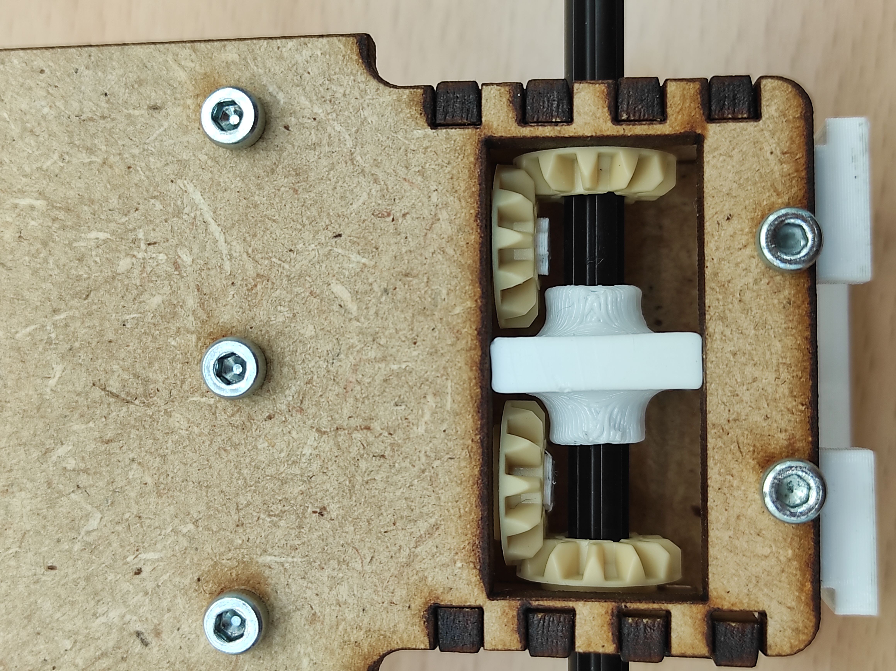
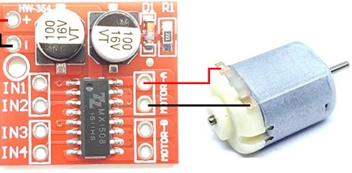
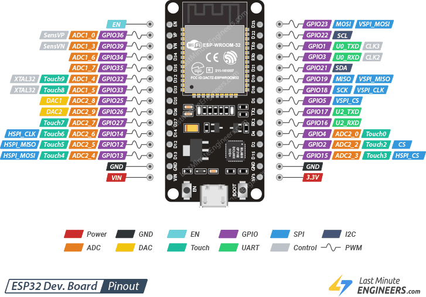

# Fall 2026 CS-358 Individual Project: a Micromouse 🐭

<!--<p align="center"></p>-->

<!--<p align="center"></p>-->

<p align="center"></p>

## Project overview

There's a very specific hobby: The one of micromice. Micromice are little robotic “mice” that are placed in a maze, and the aim is to solve the maze as quickly as possible. As you can see in [various videos](https://youtu.be/ZMQbHMgK2rw?si=J3iyXzNXOJgDFyq4), competitors design micromice that manage to solve a maze in a matter of seconds. What is particularly impressing is the speed and precision with which these micromice solve the maze.
<p align="center"><br><sub>Source: The Fastest Maze-Solving Competition On Earth<br><a>https://youtu.be/ZMQbHMgK2rw?si=60H5i8q6jv-QUGHG</a></sub></p>


Just like these spectacular micromice, we are going to build a little micromouse that uses sensors, motors, a microcontroller. But, instead of solving mazes at a high speed, this project focuses on a different but equally interesting robotics challenge: **obstacle avoidance**, similar to a robotic vacuum cleaner. (Full maze solving is a bit involved for the individual project.)

You will build a small mobile robot capable of navigating an unknown environment, avoiding obstacles, much like a simplified Roomba.

The aim of this project is to get hands-on experience in a number of areas. We'll be learning how to assemble components following a circuit, soldering, 3D design, laser-cutting and programming micro-controllers.

⚠️ **An important note**: For this project, you can use either *Arduino IDE* or *PlatformIO*. Arduino IDE is a very basic IDE and also supports ESP32 development. However, please note that the time required to upload code to the ESP32 is high (on the order of one minute).

Another option is to use PlatformIO: a famous VSCode extension for programming microcontrollers, including ESP32s. Upload times are considerably faster with PlatformIO. In addition, familiarizing yourself with PlatformIO can be useful for other projects using ESP32s, Arduino and many other microcontrollers.

Whatever your choice, you'll find a tutorial for importing the project and installing the necessary libraries on Arduino IDE and PlatformIO in the [Software](#software) section

<!--⚠️ Please consider consulting the project proposal for more details about MinosMouse :memo:[Project proposal](https://github.com/epfl-cs358/2024fa-minosmouse/blob/cbe9dc045ea7b2e5f2d51d4c105a9bb93ee3844e/Proposal/MIT___MicroMouse.pdf):memo:-->

## Micromouse design

The micromouse is 95x58mm.

In order to achieve precise movement, the micromouse makes extensive use of control theory, more specifically PID systems. Thanks to this, the micromouse can correct itself in real time using its various sensors. 


### Hardware Overview

The micromouse consists of the following components:

- 2x N20 Motors 500RPM
- 1x Motor Driver MX1508
- 1x Time-Of-Flight sensors ToF400C-VL53L1X
- 1x Microcontroller ESP32 30pin
- 1x 9V battery
- 1x Buck converter LM2596
- 1x 9V battery connector
- 2x Lego axels 4L
- 2x Lego tires
- 4x Lego gears


⚠️ Check that no parts are missing before starting the project !


 Encoders keep track of how many steps each motor has taken. This is important because, unlike stepper motors, the brushed motors we're using for this project (N20 gear motors) are not exactly the same. In fact, these motors will always have a small difference in speed between them, and we need to compensate for this difference (however slight!) so that the micromouse can move straight forward / make precise movements. Thanks to the encoders, we can compensate for the difference in speed between the two motors by reading the number of steps each motor has taken, and trying to keep this number of steps almost equal.

## Tasks

### Overview

The goal of this semester is to work close to the hardware of the mouse, you'll have to build the mouse and code the interface with the sensors and motors. The expected behavior will be to drive up to an obstacle with a nice and straight tragectory, detect it, turn away and drive away. 

### 1 Hardware

 Build the mouse based on the instructions located further below in this document.

### 2 Design your 3D-printed wheels

To practice 3D design, you will design the wheels of the micromouse (not the tires).

The dimensions of the wheels are for you to choose, but beware: The behavior of the mouse depends heavily on these parameters!

Also, since we use lego shafts to attach the wheels to the gear box, you need to make sure, when designing the wheels, that the shaft fits in the wheel. For your information, here are the lego shaft dimensions:

<p align="center"></p>

For your reference, here is an example of a wheel that you may get inspired from. The tire is given to you and fits snuggly around a 17.7mm rim. The design given uses supports inside the rail that are a pain to remove, it's your job to find a better design if you want to avoid this issue :D

<p align="center"></p>  
<p align="center"></p>

This is the opportunity to make your product stand out! Fortunately this part is quite small and is therefore quite cheap and quick to manufacture, so don't be afraid to experiment!

### 3 Software Tasks

Your software tasks are divided into several categories:

#### Implement source files from provided interfaces

You will be given `.h` header files containing function signatures. Your task is to implement the corresponding `.cpp` files so that the functions exhibit the expected behavior.

- `encoders.h`  
  Functions related to encoder usage and measurements.

- `ToF.h`  
  Functions related to the front Time-of-Flight (ToF) sensor. You will need to calibrate your sensors to have accurate readings, this can be achieved with a simple linear regression.

- `motors.h`  
  Functions defining the API used to control the motors.  
  We have provided a few function signatures that we consider important, but this is not intended to be exhaustive. You are encouraged to extend the API with any additional functions you find useful. Make it your own.
  - Active braking

    Active braking is a technique used to stop a DC motor more quickly than simply cutting power.  
    With brushed DC motors, one common method is to short the motor terminals together. While the motor is still spinning, it acts like a generator and produces a voltage known as *back EMF* (electromotive force). By shorting the terminals, this generated current flows through the motor itself, creating a torque that opposes the rotation and rapidly slows the motor down.

    With brushed DC motors, this is commonly achieved by briefly shorting the motor terminals together (aka set both pins to High)

#### Design and implement algorithms independently

For these tasks, no file structure or function signatures will be provided. You are expected to design the software architecture and implementation yourself.

#### - Motor PID control

Implement a PID controller that adjusts the power delivered to each motor so both wheels rotate at the same speed. The objective is to improve the robot’s ability to drive in a straight line. 

A PID (*Proportional–Integral–Derivative*) controller is a feedback control algorithm commonly used in robotics and automation. It continuously measures the error between a target value and the current measured value, then adjusts the system output to minimize that error over time. You are expected to research how PID control works and tune your controller appropriately.

#### - Simple obstacle avoidance behavior

Implement an algorithm that:

1. Drives the robot forward in a straight line  
2. Detects an obstacle ahead  
3. Uses active braking and correction to stop approximately 5 cm from the wall  
4. Performs a ~140 degree turn in either direction to face away from the obstacle (you will not be graded on the accurracy of that turn)
5. Continues driving forward afterward

	


## Getting started: Making the micromouse

### Assembly

⚠️ At all times during the assembly process, refer to this document or to the provided `.step` file in order to avoid mistakes.

1. First things first, you need to laser-cut and 3D-print the parts of the micromouse. You can find the CAD of the parts to be laser-cut and 3D-printed in the project repository.

	You need to laser-cut the following parts:
    - 1x Base plate
    - 2x Side walls
	- 1x Top module plate

	You need to use **3mm** MDF: A sturdy enough width without being exceedingly heavy.

	You also need to 3D-print the following parts:
    - 2x N20-to-LEGO adapters
   	- 1x Motor bracket
   	- 1x Sensors holder
	- 1x Battery holder
   	- 1x Shaft holder
   	- 1x Backplate (Buck converter holder)

	⚠️ Most 3D parts were designed to require minimal to no supports. Be sure to disable them in PrusaSlicer when not necessary and mind the orientation of the parts when scheduling a print.

	### Useful PrusaSlicer Extras
  
	⚠️ If you want to specify which side of your part you want supported you can do that by using the **brush** tool. 
	<p align="center"></p>

	⚠️Also, if you want the supports to be easily removable, you can use the **organic** supports option (although the sensor holder is the only piece that requires supports).
	<p align="center"></p>


2. Once you have laser-cut parts, you can assemble them:

	⚠️ Be patient and careful when assembling MDF parts as they are fragile

	1. Put the shaft holder in the middle of the gearbox and scew it to the base plate.
	2. Wedge the top module plate on top of the two side plates.
	3. Wedge the aforementioned assembly into the base plate, you should feel some resistance.

💭 You should use **wood glue** to make everything secure but you will not be able to disassemble your mouse afterwards should you need to debug. Only do this if you are sure that you don't want to disassemble the parts.

3. Now, we install the motors on the micromouse:
    1. Put the N20-to-LEGO adapters on the motors
    2. Press the N20 Motors into the motor bracket. It should be a snug fit
	3. Insert nuts in the battery holder. Place the battery holder on top of the motor bracket and the Screw both of them to the chassi. Screws should be inserted from the bottom of the chassis.

	⚠️ Make sure the Lego adapter tips are properly aligned. The mouse would suffer from a lot of friction otherwise !
   
4. Mounting the gear box:
	1. Install a gear on each of the N20-to-LEGO adapters. <p align="center"></p>
	2. Insert the lego shafts into the gearbox from the small hole in the gearbox walls. At the same time, add the other gear on the shaft and push it against the gearbox wall. The shafts should be maintained in place by the shaft holder which is in the middle of the gearbox.
	<p align="center"></p>

5. Install the sensor holder on the front of the chassis. The sensor holder is designed to hold the 3 ToF sensors.

6. Finally, install the backplate on the back of the chassis by screwing it to the chassis. Same for the sensors holder: Attach it to the front of the chassis and screw it.

✅ After these steps, the basic mechanism of your mouse should be complete!

### Soldering
#### General Advice 
For this project, we recommend avoiding soldering wires directly to the boards. Instead, solder male header pins to the boards and create female cable assemblies to connect them.

When soldering male header pins to boards, make sure everything is stable and will not slip or move while you are heating the board and pins with the soldering iron. When soldering straight pins, you can use a breadboard to stabilize both the board and the pins (there is no need to push the pins too far into the breadboard). Make sure you adequately heat both the board and the pin before applying solder. The solder should not bead up, as that means the joint is too cold. Instead, it should flow smoothly around the metal ring and the pin, allowing you to add solder until you are satisfied with the amount.

We also recommend using appropriately sized solder wire for the task. For example, thinner solder wire makes it easier to control the amount of solder when working with the TOF sensor pins. The correct amount of solder should form an even, slightly convex “volcano” shape around the pin.

When soldering cable assemblies, make sure the stripped wires are twisted together securely. The wires should not pull apart easily once twisted together, the solder is intended primarily for electrical connectivity, not tensile strength. Try to find a good balance for the stripped wire length: if it is too long, it will require more solder and make it harder to achieve an even spread; if it is too short, twisting the wires together will be more difficult.

As with board soldering, make sure your setup is stable and that the wires are heated adequately before applying solder. Do not keep applying solder if it beads up, as this indicates the joint is not hot enough, remove the solder and continue heating.

A properly tinned soldering iron tip should look smooth, shiny, and evenly coated with a thin layer of solder. A dry, dark, or oxidized tip will not transfer heat effectively and will make soldering much more difficult. Regularly wipe the tip on the provided steel wool or brass wool cleaner and reapply a small amount of solder to keep it tinned between joints. If you have a stubborn black spot on the tip, you can use the acid paste to help remove the oxidation, then reapply solder to the tip and wipe it clean with the steel wool.
⚠️ Acid paste should be used sparingly as it can shorten the life span of the iron.

#### Schematics

The next step is to solder all the components together. This step needs to be done carefully as there is a lot of wires to solder in a small space.  

<p align="center"></p>


Keep in mind these important points:  
1. ⚠️ While this schematic accurately represents the soldering connections you should attempt to replicate we recognize it looks very cluttered as there are a lot of connections to make. For your convenience we linked a table with pinout assignments you can follow.

2. ‼️ Keep in mind that you cannot use every pin of the ESP32. Some pins have particular behavior. Please refer to the [following website](https://randomnerdtutorials.com/esp32-pinout-reference-gpios/) to know which pins you should prefer. As always we also include correct assignements you may want to use.

3. 💭 To have some clean soldering work, make sure to use heat shrink tubes or some electrical tape

4. 💭 For modularity, instead of directly soldering wires to the components, you can solder pin headers to your various components and use female wires.

5. 💭 Keep cables as short as they possibly need to be. This will have an enormous effect on the perceived cleanliness of the finished product.

#### *Power Connections*

##### Battery connector & Buck converter input 


Solder the $9V$ battery connector to the buck converter ```IN+``` and ```IN-```. 

‼️ Since we wish to output $5V$ to our system, we need to configure the buck converter to output $5V$. For that, use a multimeter (by putting the two multimeter probes on the ```OUT+``` and ```OUT-```) to measure the output voltage of the buck converter and adjust the potentiometer (Little golden screw) until you get $5V$.

💭 You might see very slow change in the voltage at first. That is normal! Keep adusting the potentiometer until voltage changes are higher.

##### Main power bus 

From the ```OUT+``` and ```OUT-``` of the buck converter, you will join all the power wires from every component together.

<p align="center"></p>

<!-- 1. Solder the 2-PIN JST female connector to the 9V battery connector. -->

<!-- 1. From the 2-PIN JST female connector, solder two wires for power (one for the motors, and the rest for the switching regulator, to supply the rest of the components with $5V$) and one wire for ground. -->

1. Motor driver: Solder a wire for power and a wire for ground to the motor driver ```+``` and ```-``` pins.
2. Motors: 
- Left: Solder the motor ```+``` (Red wire) et ```-``` (White wire) to the motor driver (pins next to "Motor-A"). Solder a wire for encoder ```+``` (**Black** wire !) and for ```-``` (Blue wire).
- Right: Solder the motor ```+``` (Red wire) et ```-``` (White wire) to the motor driver (pins next to "Motor-B"). Solder a wire for encoder ```+``` (**Black** wire !) and ```-``` (Blue wire).

<p align="center"><br><sub>Source: <a>https://www.amazon.com/Torque-Electric-Encoder-Engine-Science/dp/B0CBR8Z617</a></sub></p>

<p align="center"><br><sub>Source: <a>https://components101.com/modules/mx1508-dc-motor-driver-pinout-features-datasheet</a></sub></p>

1. Sensors: Solder wires to ```VIN``` and ```GND``` pins of these components.
2. ESP32: Solder wire to ```V5``` and ```GND``` pins to supply power to the ESP32.
3. Join and solder all power wires together and all ground wires together (motor driver, sensors, encoders and ESP32) except for the motors, which are soldered to the motor driver. Once all the components to be supplied with $5V$ are connected together by two wire "bus" (one bus for power and one bus for ground), solder these two wire buses to the buck converter ```OUT+``` ($5V$ power bus) and ```OUT-``` (ground).

#### *Data Connections*

<p align="center"></p>

- ##### Encoders
	1. Left motor encoder: Solder the **yellow** & the **green** wire of the encoder to pins of the ESP32.
	2. Same idea for the right motor encoder.

- ##### Motor Driver
	1. Left motor: Solder a wire between the **pin INT1** (Forward) of the motor driver and a pin of the ESP32. Same for the **pin INT2** (Backward), but with another pin of the ESP32.
	2. Same idea for the right motor.

	⚠️ Make sure that the pins you use are not "input only" pins (i.e GPIO 34, 35, 36, 39). 

- ##### X-SHUT
  	The X-SHUT pin is used to switch off the sensor. In case there we multiple sensors, we would need to switch them off one by one in order to redefine their addresses, because if they use the same addresses on the $I^2C$ bus, they'll send data to the same address and the data read by the ESP will be incorrect. (You don't have to worry about this aspect as there is only one sensor).

	1. Solder a wire between the **X-SHUT pin** of the sensor and a pin of the ESP32.

<br>

📝 In an ESP32 system, peripherals like ToF sensors communicate with the microcontroller on the same $I^2C$ bus (this is why in the schematic the SDA / SCL cables are combined), a multi-device serial protocol. Each device (sensor in our case) has a unique address, allowing the ESP32 to send commands and receive data.

- ##### Common $I^2C$ bus: 
  
	<p align="center"></p>

💭 Often, the default $I^2C$ address is written on the rear face of the component.

<!-- After all these steps, you should have the following backbone:

<p align="center"></p> -->

### Mounting the electronical components

Once every electrical component has been soldered, we can mount them on the micromouse, in their appropriate place. Most of the screw to be used are M2.5 screws, except for the sensors, which are M2 screws.

And voilà! Your mouse is completed!

## Software

We need to setup the environment in which you will work on to be able to program and upload code to the micromouse.

If you want to use PlatformIO, follow the instructions below. If you want to use Arduino IDE, please refer to the [Arduino IDE](#arduino-ide) section.
### PlatformIO

1. Install VSCode on your computer. You can download it [here](https://code.visualstudio.com/).
2. In the extensions tab, search for PlatformIO and install it.
3. Download the [code](???) from the repository.
4. In VSCode, go to ```File``` > ```Open```. Look for the directory you just downloaded and open it. You should see a ```platformio.ini``` file in the root directory of the project.
5. Click on the PlatformIO icon in the left sidebar. Wait a bit for the project to load. Once it is loaded, you should see ```Build```, ```Upload``` and many other options under the ```Project Tasks``` section.
6. That's it ! You can now start coding in the ```src``` directory. The main file is ```main.cpp```. Each time you want to upload the code to the micromouse, click on the ```Build``` button in the PlatformIO sidebar, and then ```Upload```. If you want to read the serial monitor, click on the ```Upload and monitor``` button in the PlatformIO sidebar.

⚠️ If you have any issues when uploading the code, this may due to the fact that there is an "Upload" terminal still open. Close it (on the right of the VSCode window) and try again.
‼️ Make sure to disconnect the power pin of your ESP32 before uploading code. Not doing so sometimes leads to your laptop not recognizing the ESP.

### Arduino IDE
<!-- Follow [this tutorial](https://github.com/epfl-cs358/2024fa-minosmouse/blob/7f18ae96e44351af6db0aecf736b499a816c7f0b/Code/README_PIO.md) to install the necessary extension required for this project. -->
1. Install Arduino IDE on your computer. You can download it [here](https://www.arduino.cc/en/software).
2. Open Arduino IDE and go to ```Tools``` > ```Board``` > ```Boards Manager```.
3. In the search bar, type ```ESP32```.
4. Install the package made by "Espressif Systems".
5. Now, let's install the libraries we need for the sensors: 
	1. Go to ```Tools``` > ```Manage Libraries```.
	2. In the search bar, type ```VL53L1X``` & install the first one that appears.
6. You can now open the downloaded project in Arduino IDE. Go to ```File``` > ```Open``` and select the ```src``` directory of the project you just downloaded. You should see a ```main.cpp``` file in the root directory of the project, this is the file you will be working on.

‼️ If your computer doesn't recognize the ESP32, you may need to install a driver. You can find a tutorial here: [MacOS](https://randomnerdtutorials.com/install-esp32-esp8266-usb-drivers-cp210x-mac-os/) or [Windows](https://randomnerdtutorials.com/install-esp32-esp8266-usb-drivers-cp210x-windows/).

## Debugging - Testing the components the micromouse

To ensure that everything is working properly, and that your soldering work is correct, we want to test every components of the micromouse.  

For that, we provide you with a ```healthcheck.cpp``` file, which contains functions to check if everything is working properly: It will help you read the sensors, check that the motors work as expected and that the value read by the encoders are correct.

- Sensors: If you notice that the sensors doesn't work or you have some $I^2C$ related errors (appearing on the serial monitor), then first check in the pin assignment (this is probably due to some faulty X-SHUT pin assignment) in ```wiring.h```. If the pin assignment is correct, check your soldering work again. Also, if the values are not accurate, you may want to adjust the offset values in ```config.h```.
- Motors: If the motors don't go in the expected direction, then you should invert the pins of the motors in ```wiring.h```. If a motor doesn't work at all, then recheck the pins and/or your soldering work.
- Encoders: When moving forward the mouse should have positive values for the encoders, and negative values when moving backward. If the values are not correct, then check the pin assignment of the encoders and your soldering work. If the values doesn't get updated at all, then check your pin assignment and/or your soldering work.

If everything works as expected, then you have the necessary basis to start programming the micromouse !

## Appendix: Pinout

<p align="center"><br><sub>Source: <a>https://www.upesy.com/blogs/tutorials/esp32-pinout-reference-gpio-pins-ultimate-guide?shpxid=94928d88-3b39-46f8-bb16-cd075441d1bf</a></sub></p>

Here is an example of a pin assignment for the ESP32.

| Component            | Pin Name                | ESP32 Pin |
|----------------------|-----------------------------|----------------|
| Sensors 			   | I2C SDA                     | 21             |
| Sensors			   | I2C SCL                     | 22             |
| Left Motor           | INT1 (Motor Driver)         | 26             |
| Left Motor           | INT2 (Motor Driver)         | 25             |
| Right Motor          | INT3 (Motor Driver) 	     | 33             |
| Right Motor          | INT4 (Motor Driver)         | 32             |
| Front Sensor         | XSHUT_PIN_CENTER            | 19             |
| Left Encoder         | SIGNAL_FEEDBACK_YELLOW_LEFT | 15             |
| Left Encoder         | SIGNAL_FEEDBACK_GREEN_LEFT  | 2             |
| Right Encoder        | SIGNAL_FEEDBACK_YELLOW_RIGHT| 4             |
| Right Encoder        | SIGNAL_FEEDBACK_GREEN_RIGHT | 5             |
| Power & Ground       | 5V and GND                  | Vin and GND     |
| Sensor power 		   | Vin and GND 				 | 3.3V and GND |
